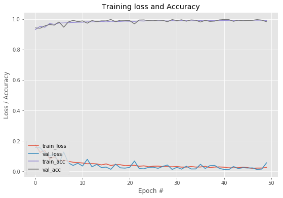
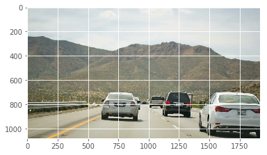
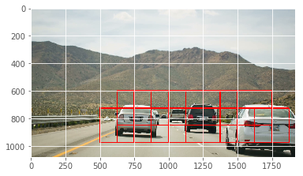

# vehicle_detection

Detecting and Tracking Vehicles from Image

data src : 

https://s3.amazonaws.com/udacity-sdc/Vehicle_Tracking/vehicles.zip

https://s3.amazonaws.com/udacity-sdc/Vehicle_Tracking/non-vehicles.zip

Model produces a good output.

Test input

Test output

